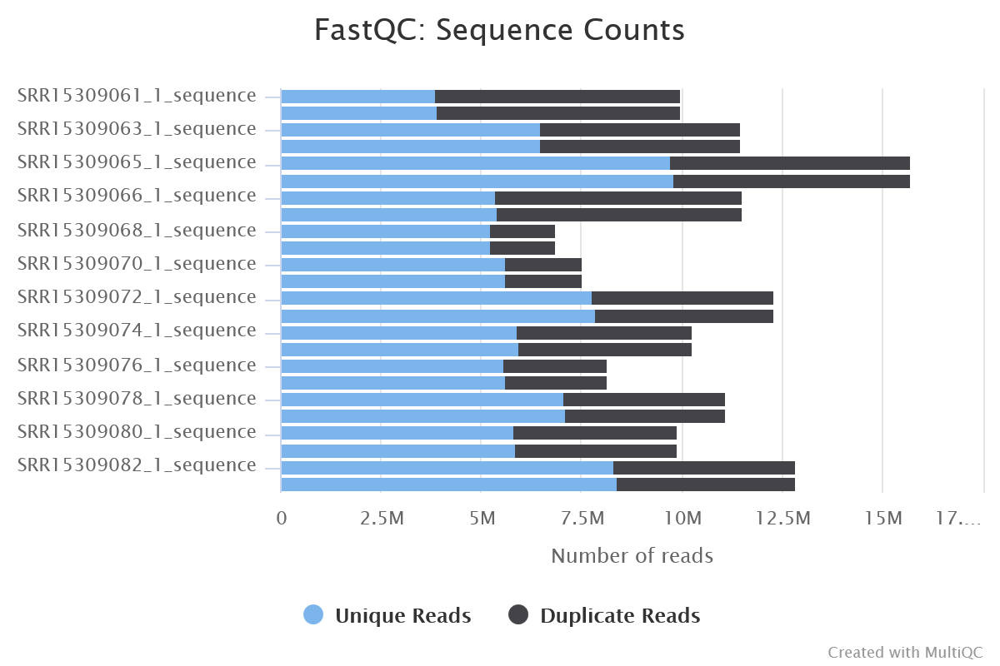
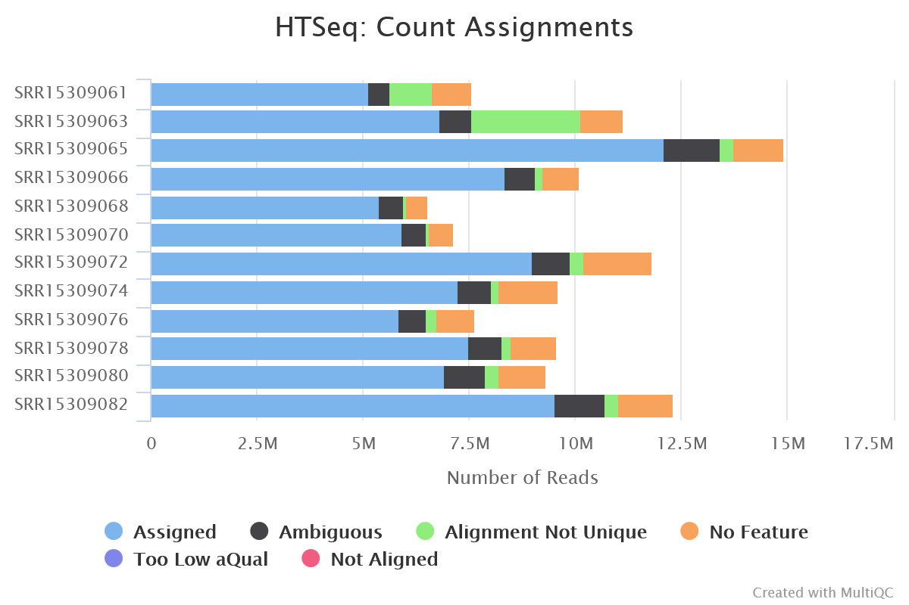
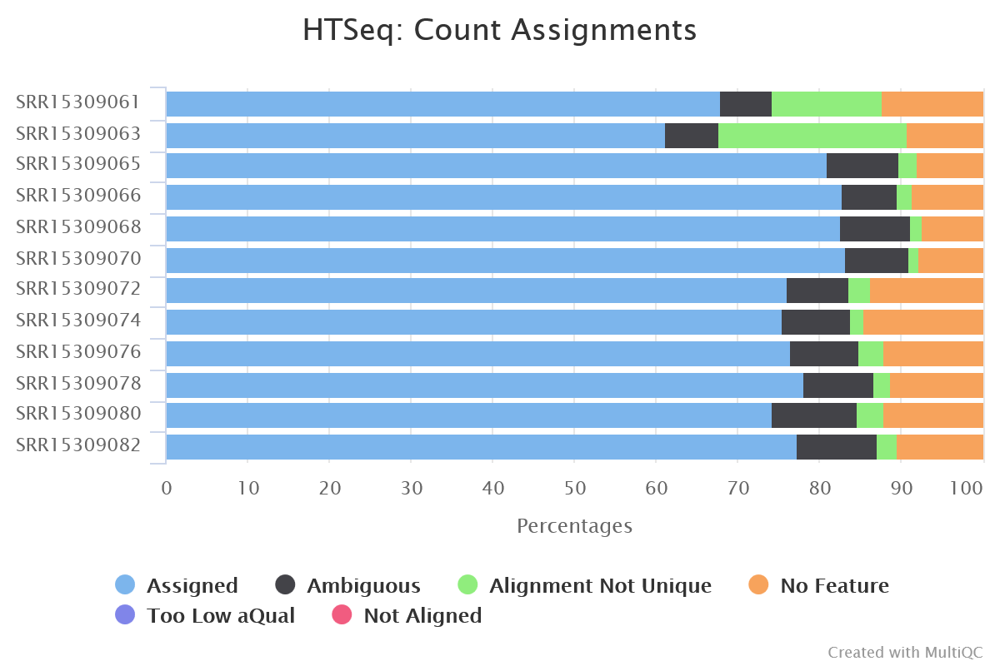
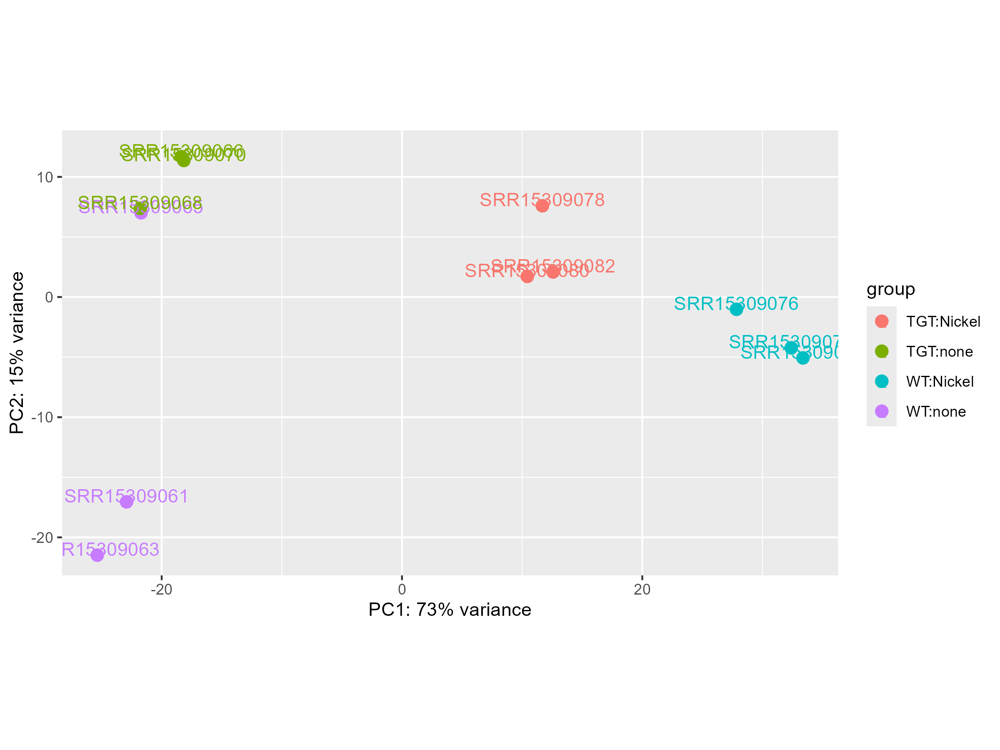
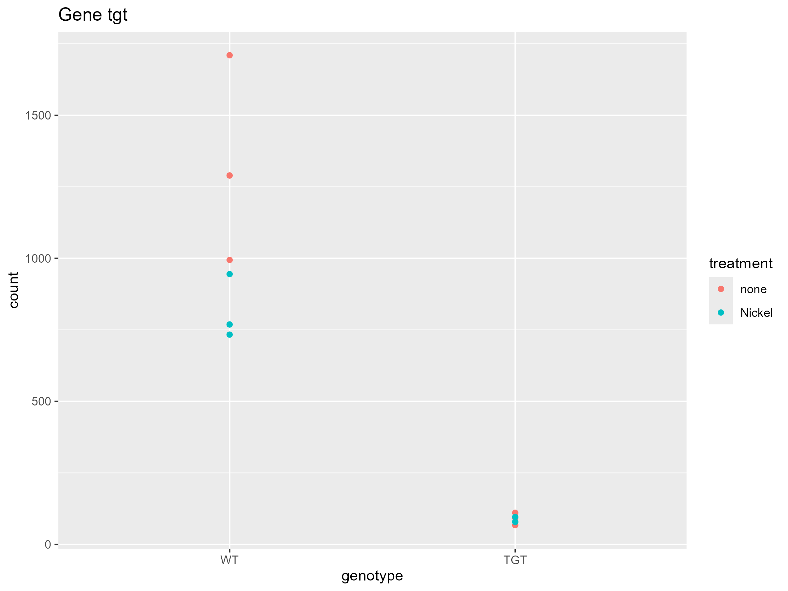

```{r setup, include=FALSE}
knitr::opts_chunk$set(
  echo = TRUE,
  warning = FALSE,
  message = FALSE,
  fig.align = "center",
  fig.pos = "H"
)

knitr::write_bib(c("DESeq2", "ggplot2", "tidyverse",
                   "knitr", "rmarkdown"), file = 'packages.bib')
```

\newpage
# Introduction

# Raw Reads and Mapping QC

## FastQC:

a)  According to FastQC: What was the minimum and the maximum number of read pairs sequenced per sample?

```{r, echo=FALSE, out.width="85%", fig.cap=' Barplot of the number of read pairs per sample.'}

```

**Answer:** As can be seen in Figure 1 the minimum number of reads per sample is around 6.8 million and the maximum number of reads per sample is around 15.7 million.

b)  What is the most overrepresented sequence (string of nucleotides) that was found by FastQC?

**Answer:** According to the MultiQC report the most overrepresented sequence was:

```         
  "AAAAAAAAAAAAAAAAAAAAAAAAAAAAAAAAAAAAAAAAAAAAAAAAAA"
```

c)  What might be the reason there is so much of this specific sequence/homopolymer ?

**Answer:** This could be from A tailed adapter dimers and PCR slippage products that outcompete genuine RNA fragments in the library.

## HTSeq-count:

d)  According to HTSeq Count: What was the minimum and the maximum number of read pairs reported per sample?

```{r, echo=FALSE, out.width="85%", fig.cap=' Barplot of the number of read pairs, per sample HTSeq.'}

```

**Answer:** As can be seen in Figure 2 the minimum number of reads per sample is around 5.9 million and the maximum number of reads per sample is around 14.8 million.

\newpage

f)  Which was the minimum and maximum percentage of reads uniquely assigned to a gene, as reported by HTSeq-count?

```{r, echo=FALSE, out.width="85%", fig.cap='HTSeq assignment plot in percentages.'}

```

**Answer:** As can be seen in Figure 3 the minimum percentage of reads uniquely assigned to a gene is 61.3% and the maximum percentage of reads uniquely assigned to a gene is around 83.3%.

# Dataset

## Raw read counts

## Sample information

a)  Which columns define the used base strain and substrain (WT or TGT mutant), respectively? Can you spot an error in one of those columns?

**Answer:** The genotype column shows if the wild type or tgt mutant was used. The strain column shows wich *E.coli* strain was used. The error is in the strain column suggesting that for every experiment a different strain was used. But comparing this with the strains and method supsection of the methods section of the paper shows that only "Escherichia coli K-12 MG1655 was used as the WT strain.".[@pollo2022absence]

b)  Which column defines if nickel was added to the media?

**Answer:** The treatment column defines if nickel was added to the media.

c)  Find the following information on the SRA Study page:

> Which type of Illumina machine was used for sequencing?

> **Answer:** Illumina HiSeq 2500

> What was the library layout?

> **Answer:** PAIRED

> When was the data released?

> **Answer:** 2022-05-16

# Preprocessing of the data

## Filtering of the data

a)  For how many genes did we originally retrieve count data?

```{r, eval=FALSE}
dim(rawCounts)
#[1] 4295   12
```

**Answer:** Originally count data were retrieved for 4295 genes

b)  How many will be left after applying the filter?

```{r, eval=FALSE}
dim(rawCounts[rowSums(rawCounts) > 10, ])
#[2] 4221   12
```

**Answer:** After applying the filter 4221 genes will be left.

# DGE Analysis

## Differential Expression Analysis

## Extracting results

Interpreting the summary:

a)  How many genes are significantly up-regulated and how many are significantly down-regulated in the nickel treated WT strain as compared to the untreated WT strain, using the default cutoff for the adjusted p-value?

```{r, eval=FALSE}
# Extract results with default alpha (0.1)
DESeq2Results_WT_nickel <- results(DESeq2Data, 
                                   contrast = c("group","WT.Nickel","WT.none"))

# View summary
summary(DESeq2Results_WT_nickel)


# out of 4221 with nonzero total read count
# adjusted p-value < 0.1
# LFC > 0 (up)       : 1069, 25%
# LFC < 0 (down)     : 1063, 25%
# outliers [1]       : 6, 0.14%
# low counts [2]     : 0, 0%
# (mean count < 1)
# [1] see 'cooksCutoff' argument of ?results
# [2] see 'independentFiltering' argument of ?results
```

**Answer:** 1069 genes are significantly up-regulated and 1063 genes are significatnly down-regulated in the nickel treated WT strain as compared to the untreated WT strain, using the default cutoff for the adjusted p-value of 10%.

b)  What is the standard cutoff used for the significance level (adjusted p-value), if we don’t change it?

**Answer:** The standard cutoff used for the significance level (adjusted p-value), if we don’t change it is 10% (p-value \< 0.1).

c)  How many significantly differentially expressed genes does that make in total?

```{r, eval=FALSE}
# Extract TGT.Nickel vs TGT.none with alpha = 0.1
DESeq2Results_TGT_nickel <- results(DESeq2Data, 
                                    contrast = c("group","TGT.Nickel","TGT.none"),
                                    alpha = 0.1)

# View summary
summary(DESeq2Results_TGT_nickel)


# out of 4221 with nonzero total read count
# adjusted p-value < 0.1
# LFC > 0 (up)       : 986, 23%
# LFC < 0 (down)     : 877, 21%
# outliers [1]       : 6, 0.14%
# low counts [2]     : 164, 3.9%
# (mean count < 5)
# [1] see 'cooksCutoff' argument of ?results
# [2] see 'independentFiltering' argument of ?results
```

**Answer:** If we add up the up und down regulated genes we get the total amount of significantly differentially expressed genes. Looking at the summary this would be 1863 genes.

> Changing the alpha factor:

d)  For the comparison of the genotypes under standard contitions. How many significantly differentially expressed genes in total are reported for a significance level of 0.05? (Go to the RStudio Help and search for “results” function, to identify the attribute you have to change.)

```{r, eval=FALSE}
# Extract genotype comparison (TGT vs WT, no nickel) with alpha = 0.05
DESeq2Results_genotype <- results(DESeq2Data, 
                                  contrast = c("group","TGT.none","WT.none"),
                                  alpha = 0.05)

# View summary (this shows the numbers you need)
summary(DESeq2Results_genotype)


# out of 4221 with nonzero total read count
# adjusted p-value < 0.05
# LFC > 0 (up)       : 187, 4.4%
# LFC < 0 (down)     : 275, 6.5%
# outliers [1]       : 6, 0.14%
# low counts [2]     : 0, 0%
# (mean count < 1)
# [1] see 'cooksCutoff' argument of ?results
# [2] see 'independentFiltering' argument of ?results
```

**Answer:** If we add up the up und down regulated genes we get the total amount of significantly differentially expressed genes. Looking at the summary this would be 462 genes at a p-value \< 0.05.

Comparing the nickel treatment to no treatment in the TGT-mutant:

e)  Repeat the steps above for the comparison of the TGT-mutant strain treated with nickel to the TGT-mutant strain not treated with nickel. How many significantly differentially expressed genes in total are reported for a significance level of 0.05?

```{r, eval=FALSE}
# Extract TGT mutant nickel effect with alpha = 0.05
DESeq2Results_TGT_nickel <- results(DESeq2Data, 
                                    contrast = c("group","TGT.Nickel","TGT.none"),
                                    alpha = 0.05)

# View summary (this shows the numbers you need)
summary(DESeq2Results_TGT_nickel)

# out of 4221 with nonzero total read count
# adjusted p-value < 0.05
# LFC > 0 (up)       : 826, 20%
# LFC < 0 (down)     : 752, 18%
# outliers [1]       : 6, 0.14%
# low counts [2]     : 82, 1.9%
# (mean count < 3)
# [1] see 'cooksCutoff' argument of ?results
# [2] see 'independentFiltering' argument of ?results
```

**Answer:** If we add up the up und down regulated genes we get the total amount of significantly differentially expressed genes. Looking at the summary this would be 1578 genes at a p-value \< 0.05.

# Vizualising data

## Experimental QC - Clustering of samples (PCA)

```{r, echo=FALSE, out.width="85%", fig.cap='Clustering of samples PCA dot plot.'}

```

a)  Do the groups of replicates behave as expected?

**Answer:** Looking at the plot in figure 4 we can observe that the individual groups are clearly separated from each other. It also makes sense that there is a big distance between untreated and Nickel treated strains (WT as well as TGT strains).

b)  Which sample would you identify as an outlier?

**Answer:** Looking at figure 4 we would identify the WT strain untreated as an outlier as it does not completely cluster with its biological replicates but one point also clusters with the TGT untreated cluster.

## Viewing counts for a single geneID

```{r, echo=FALSE, out.width="85%", fig.cap='Viewing counts for a single geneID in a dot plot.'}

```

c)  Think about the mutations in the E. coli strains and how that influences the transcripts of a gene. Are the read counts for the tgt gene in the wild type and the knockout strain what you expected? Explain why. \newpage

**Answer:**

Wild type + none: tgt encodes tRNA guanine transglycosylase, an essential enzyme for queuosine synthesis. It is expressed under normal growth conditions to modify tRNAs. Expected Counts are going to be high.

Wild type + Nickel: tgt is transcriptionally repressed by nickel stress. Expected Counts are going to be lower than that of Wt + none but still higher than the expected counts of the knock out mutants.

tgt + none: The tgt gene is deleted so No functional tgt should be transcribed. Expected counts are going to be very low to near zero.

tgt + Nickel: The tgt knock out stais the same but now Nickel is added. This should not have a significant affect on the already very low to near zero counts.


# Part 2: Functional Analysis and Vizualisation
## Setup

```{r, eval=FALSE}
BiocManager::install(c("clusterProfiler"))
install.packages("tidyverse")

install.packages("devtools")
devtools::install_github('kevinblighe/EnhancedVolcano')
```

```{r}
library(EnhancedVolcano)
library(clusterProfiler)
library(tidyverse)
library(ggplot2)
library(dplyr)
library(DESeq2)
```


```{r}
### load the data with read delim, because it is tab seperated
annotatedRawCounts <- read_delim("Counts_raw.tsv")

head(annotatedRawCounts)

annotatedRawCounts <- annotatedRawCounts  %>% 
  column_to_rownames(var = "ID")

### split data into rawCounts and Annotations
rawCounts <- annotatedRawCounts[,3:14]
annotations <- annotatedRawCounts[,1:2]

DESeq2ResultsDF <- read_delim("DESeq2Result_treatment.tsv")
```

# Gene annotation (databases)

a)  If you look closely at the 21 OrgDB packes, there are 2 different packages for E. coli. Which one should we use? 

```{r, echo=FALSE, out.width="85%", fig.cap='Website of the used database for E.coli K12.'}
knitr::include_graphics("database.png")
```

```{r}
BiocManager::install("org.EcK12.eg.db")

library(org.EcK12.eg.db)
```

**Answer:** Since we are working with E. coli K12 MG1655 it would make sense to use the genome wide annotation package for E.coli K12  (org.EcK12.eg.db)


c)  List the different available keytypes/identifiers.

```{r}
#gene names/identifiers
genes <- annotations$gene
head(genes,10)

#View all available keytypes
keytypes(org.EcK12.eg.db)
```

**Answer:** The different keytypes and identifiers are shown above.

d)  Which of the keytypes/identifiers include the gene names given in the annotation?

```{r}
keys <- keys(org.EcK12.eg.db, keytype = "SYMBOL")
head(keys)

#make sure our IDs are contained in the keys
#prints the number of genes that are found within the keys
sum(genes %in% keys)
```

**Answer:** After iterating through all different keytypes, SYMBOL was found to contain the genes.


# Running functional analysis
## Overrepresentation analysis

a)  How many significantly up- and downregulated genes are left, after applying the LFC cutoff?

```{r}
# filter our results by padj and log2FoldChange
res_up <- dplyr::filter(DESeq2ResultsDF, padj < 0.05 & log2FoldChange > 1)
res_down <- dplyr::filter(DESeq2ResultsDF, padj < 0.05 & log2FoldChange < -1)

# extract gene IDs for upregulated genes
genes_up_id <- res_up$ID
genes_up <- annotations[genes_up_id,"gene"]

# extract gene names for downregulated genes
genes_down_id <- res_down$ID
genes_down <- annotations[genes_down_id,"gene"]

# append both lists to get all deregulated genes
genes_de <- c(genes_up,genes_down)

length(genes_up)
length(genes_down)
length(genes_de)
```

**Answer:** With the *length* command we can show the number of genes up- or downregulated. 
In total, 660 genes were up- and 582 genes were downregulated. In sum, 1242 genes are deregulated.

b)  How many significantly over-represented biological processes (GO terms) are there, per subset of genes (all differentially expressed genes, up-regulated genes only, down-regulated genes only.)

```{r}
EC <- "org.EcK12.eg.db"
EC_KEY <- "SYMBOL"

orBP <- enrichGO(genes_de, 
                 EC, 
                 ont="BP",
                 keyType = EC_KEY,
                 pvalueCutoff=0.05) 


orUpBP <- enrichGO(genes_up, 
                 EC, 
                 ont="BP", 
                 keyType = EC_KEY, 
                 pvalueCutoff=0.05) 


orDownBP <- enrichGO(genes_down, 
                 EC, 
                 ont="BP",
                 keyType = EC_KEY,
                 pvalueCutoff=0.05)

#To show the number of statistically significant GO terms
n_BP_all <- nrow(orBP)
n_BP_up <- nrow(orUpBP)
n_BP_down <- nrow(orDownBP)

print(n_BP_all)
print(n_BP_up)
print(n_BP_down)

```

**Answer:** There are in summary 100 GO terms deregulated, 59 up and 93 down. For a quick look into the first few results, take a look at the tables below.

```{r, echo=FALSE}
orBP_df <- as.data.frame(orBP)[1:5, c("Description", "p.adjust", "Count")]
orUpBP_df <- as.data.frame(orUpBP)[1:5, c("Description", "p.adjust", "Count")]
orDownBP_df <- as.data.frame(orDownBP)[1:5, c("Description", "p.adjust", "Count")]

knitr::kable(orBP_df,
caption = "Overrepresented BP terms - All DE genes",
format = "latex")

knitr::kable(orUpBP_df,
caption = "Overrepresented BP terms - Upregulated genes",
format = "latex")

knitr::kable(orDownBP_df,
caption = "Overrepresented BP terms - Downregulated genes",
format = "latex")

```

# Vizualization
## Vulcano Plot

a)  Which is the most down-regulated gene and which is the most up-regulated gene, in terms of LFC?

```{r}
# Set a boolean column for significance
DESeq2ResultsDF$significant <- ifelse(!is.na(DESeq2ResultsDF$padj) & DESeq2ResultsDF$padj < .05 , T, F)

## Add gene annotations
DESeq2ResultsDF$gene <- annotations[DESeq2ResultsDF$ID,"gene"]

EnhancedVolcano(DESeq2ResultsDF,
                lab =  DESeq2ResultsDF$gene,
                x = 'log2FoldChange',
                y = 'padj',
                pCutoff = 0.05)# + xlim(0,2.5) + ylim(0,10) you can further restrict the plot by setting limits on x an y axis


#show the entry with the highest log2FoldChange
DESeq2ResultsDF[DESeq2ResultsDF$log2FoldChange == max(DESeq2ResultsDF$log2FoldChange),]

#show the entry with the lowest log2FoldChange
DESeq2ResultsDF[DESeq2ResultsDF$log2FoldChange == min(DESeq2ResultsDF$log2FoldChange),]

ggsave('figs/volcano_plot.png', width = 12, height = 8)
```

**Answer:** The most upregulated gene is *ytiD* with a L2FC of 8.82. The most downregulated gene is *btsT* with a L2FC of -7.78.

b)  How many times are those genes higher or lower expressed in treated compared to untreated WT strain? (Calculate the fold change from the LFC)

```{r}
DESeq2ResultsDF <- read_delim("DESeq2Result_treatment.tsv")
res_df <- as.data.frame(DESeq2ResultsDF)

most_up_idx <- which.max(res_df$log2FoldChange)
most_up <- res_df[most_up_idx, ]

most_down_idx <- which.min(res_df$log2FoldChange)
most_down <- res_df[most_down_idx, ]

gene_name_up <- annotations[most_up$ID, "gene"]
gene_name_down <- annotations[most_down$ID, "gene"]


most_up$foldChange <- 2^most_up$log2FoldChange
most_down$foldChange <-  2^most_down$log2FoldChange

most_up$gene <- gene_name_up
most_down$gene <- gene_name_down

print(c(most_up$log2foldChange, most_up$foldChange ,most_up$gene ))
print(c(most_down$log2foldChange, most_down$foldChange, most_down$gene))

```

**Answer:** For a comprehensive comparison, we can do this manually by thinking of how the LFC is defined. Since it's a logarithmic function with base 2, we can calculate the FoldChange: FC = 2^LFC and compare the results manually. For faster and automated calculation, one may use the code above, which takes the data from the DESeq dataset for treated and untreated WT and calculates the FC.
Gene *ytiD* is 451.1 times higher transcribed than in untreated WT.
Gene *btsT* is 

\newpage

# References
